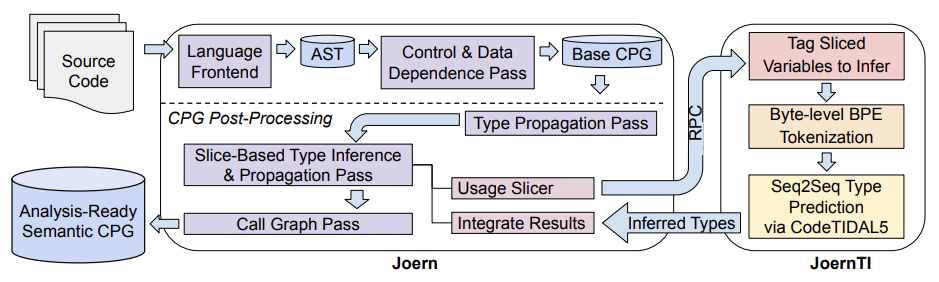

<p align="center">
  
</p>

-------------------------------------

# JoernTI x CodeTIDAL5

Artifact for [_Learning Type Inference for Enhanced Dataflow Analysis_](#Citation)

This repository provides means to add neural type inference to the code analysis platform [Joern](https://github.com/joernio/joern).
The newly introduced pass makes use of a Large Language Model during the usual post-processing passes for the `jssrc2cpg` language frontend to infer additional type information where it is missing.  

## Installation
For this process to make use of the neural type inference server, the JoernTI backend must be installed first.
You can initialize the `joernti` submodule by running:
```
git submodule update --init --recursive
```  
Before running the type inference passes with Joern, follow its install instructions and start the backend server: 
```bash
joernti codetidal5 --run-as-server`
``` 

You can then proceed to use JoernTI together with Joern:
```
sbt stage astGenDlTask
./joernti-codetidal5 <target_source_directory> -Dlog4j.configurationFile=log4j2.xml
```

## Configuration
While the default values are usually all that is necessary, there are additional configurations available:

```
=== JoernTI x CodeTIDAL5 ===
Usage: joernti-codetidal5 [options] input

  --help
  input                    source code directory (JavaScript or TypeScript)
  -o, --output <value>     output path for the CPG (Default 'cpg.bin')
  -h, --hostname <value>   JoernTI server hostname (Default 'localhost')
  -p, --port <value>       JoernTI server port (Default 1337)
  --typeDeclDir <value>    the TypeScript type declaration files to improve type info of the analysis
  --logTypeInference       log the slice based type inference results (Default false for performance)
  -m, --min-calls <value>  the minimum number of calls required for a usage slice (Default 1)
  --exclude-op-calls       excludes <operator> calls from the slices, e.g. <operator>.add, <operator>.assignment, etc.
```

One notable configuration is to set `--typeDeclDir ./type_decl_es5` which checks for type constraint violations
according to the ES5 standard library types.

For validating this artifact with the results of the paper, a good combination would be:
```
./joernti-codetidal5 <target_source_directory> --logTypeInference --typeDeclDir ./type_decl_es5
```

The argument `logTypeInference` will provide CSVs listing what was inferred and print any schema violating inferences.

**Note**: This demo is aimed at version `v0.0.44` of [JoernTI](https://github.com/joernio/type-inference-models/releases/tag/v0.0.44). 

## Experiments
For experimenting with the ML model and the datasets used in `./experiments`, install the dependencies incl. CUDA and 
PyTorch 2.0 (GPU required):
```shell
cd ./experiments
./install_cuda_pytorch.sh
```  

You can find scripts and instructions how to generate a training dataset for type inference with a decoder model such as CodeT5 in `./experiments/training_dataset`.

## Slice Dataset
[](https://doi.org/10.5281/zenodo.8321614)

We also publish a dataset of object usage slices for ~300k TypeScript programs, extracted with [Joern Slice](https://github.com/joernio/joern/blob/master/joern-cli/JOERN_SLICE.md).
The slices have been obtained from open source programs in the [The Stack](https://huggingface.co/datasets/bigcode/the-stack) dataset.

An example can be found in [`./testcode/test_slice`](testcode/test_slice).

## Citation
If you use JoernTI / CodeTIDAL5 in your research or wish to refer to the baseline results, we kindly ask you to cite us:
```bibtex
@inproceedings{joernti2023,
  title={Learning Type Inference for Enhanced Dataflow Analysis},
  author={Seidel, Lukas and {Baker Effendi}, David and Pinho, Xavier and Rieck, Konrad and {van der Merwe}, Brink and Yamaguchi, Fabian},
  booktitle={28th European Symposium on
Research in Computer Security (ESORICS)},
  year={2023}
}
```

## Related Work

###### [ManyTypes4TypeScript: A Comprehensive TypeScript Dataset for Sequence-Based Type Inference](https://www.kevinrjesse.com/pdfs/ManyTypes4TypeScript.pdf), International Conference on Mining Software Repositories (MSR) 2022

###### [Deep Learning Type Inference](https://vhellendoorn.github.io/fse2018-j2t.pdf), ACM ESEC/FSE `18

###### [LAMBDANET: PROBABILISTIC TYPE INFERENCE USING GRAPH NEURAL NETWORKS](https://openreview.net/pdf?id=Hkx6hANtwH), ICLR `20

###### [Probabilistic Type Inference by Optimising Logical and Natural Constraints](https://arxiv.org/pdf/2004.00348.pdf), arXiv preprint `20

###### [Advanced Graph-Based Deep Learning for Probabilistic Type Inference](https://arxiv.org/pdf/2009.05949.pdf), arXiv preprint `20

###### [Learning type annotation: is big data enough?](https://dl.acm.org/doi/abs/10.1145/3468264.3473135), ESEC/FSE `21

###### [FlexType: A Plug-and-Play Framework for Type Inference Models](https://dl.acm.org/doi/abs/10.1145/3551349.3559527), ASE `22

###### [Learning to Predict User-Defined Types](https://dl.acm.org/doi/10.1109/TSE.2022.3178945) ICSE `23

###### [To Type or Not to Type: Quantifying Detectable Bugs in JavaScript](https://ieeexplore.ieee.org/document/7985711) ICSE `17